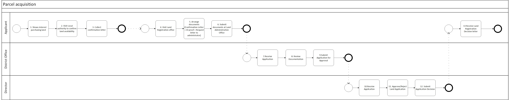

# process-diagram
 

##

##

 
 
 

## Intro
### Summary
In large programs, the business process is the best artefact that can be used to describe the business interactions, scope, actors, scenarios' permutations, and, to some extent, system functionality.  
If used correctly, business process diagrams can summarise many business interactions with multiple Actors, including multiple Applications online and offline activities, can indicate sequentially Activities, and can break down large processes into sub-processes.   
After the business processes documentation is completed, they are usually used as input for many other consequent works, including Architects, who receive them and consider them as input for business and system requirements.   
Sometimes, Architects need help reading these business processes because they are not detailed enough, or the notations and standards used to document them make them ambiguous. So, to streamline the work of business analysts and architects, it is better to adopt some standards and notations beforehand. This way, the documented business processes can be transformed into functional and system requirements. So, the Architects need to collaborate with the Business analysts to understand these diagrams and transform them into business and system requirements.   
If there are no standards or agreements on the use of notations, then the business processes are created with different styles, and usually, there is also a difference in the documentation if more than one business analyst works on them.  Sometimes, business analysts have different skills and opinions on how much detail these diagrams should have, and if there is no guidance, they use their criteria.  Some business analysts may use a high-level approach to describe the business flows. On other occasions, they may use detailed notations to describe business logic.   
This article proposes guidance and the adoption of specific notations; it discusses the benefits and other options for some scenarios when documenting large business processes. The guidance is based on the standards proposed by BPMN and UML, particularly the swimlane process diagrams and the activity diagrams intersection. <be>
With this guidance, business analysts can collaborate seamlessly. The architects can now use the business processes as they have been produced as input for their solutions, architecture design, and applications. <be>
Also, the product owners or scrum masters can benefit from these guidances because they can use these business processes as input for their agile process, in particular, to define epics and create user stories.    
If the process diagrams are too high level, do not show all the actors involved, or do not show enough details for architects to use as input, it could require that the process diagrams be further refined and clarified before actually being useful for architecture input.    
Discussing the purpose and the motivation of defining which standards to use when constructing these process diagrams can increase the productivity of the business analyst and the architects involved in large projects.    
 
 
 
#### References
 
Most of the notations are taken from the modern definition of OMG BPM and OMG UML Activity Diagrams.  
 
Object Management Group  (OMG®) 
https://www.bpmn.org/  
 
OMG® - Business Process Management Notation® (BPMN) - Definition  
http://www.omg.org/spec/BPMN/2.0/  
 
OMG® - BPMN Version 2.0   
https://www.omg.org/spec/BPMN/2.0/PDF  

* Section  11.7.2 Swimlanes (Page 363)  
* Section 10.2 Activities (Page 151)  
 
OMG® - Unified Modeling Language® (UML) Definition  
http://www.omg.org/spec/UML/   
 
OMG® - UML Version 2.5.1   
https://www.omg.org/spec/UML/2.5.1/PDF  

* Section 15. Activities  (Page 373)  
* Sub-section 15.5 Executable Nodes (Page 403)  
* Sub-section 15.6 Activity Groups (Page 405)  
 
 
 

#### Example
<!-- 

-->
 

## Swimlines
 
 
 

## Actors
 
 
 

## Activity 
Activities signify a granular task that is performed as part of the process.  
### Offline and Online
Notice that there could be offline and online Activities.   
* Online Activities    
  They are not performed in any system. They are usually paper-based activities that cannot be or do not necessarily need to be recorded by a system.  <be>
 

* Offline Activities    
  These are Activities performed in a system or platform; the Activities create an immediate digital footprint that can be traced. <be>
 

### Naming conventions
#### Offline Activities names
Off-line Activities can be named as best described, for example, by using a verb and nouns:    

* "Collect a pamphlet"
* "Ring the bell"
* "Complete paper form"
* "Post letter"
 
  
#### Online Activities names
On the contrary, Activities' names can be more structured since they are meant to be digitised; therefore, they should be named after the operation performed (a verb) and the entity (noun).  
The operation is a verb that, in most cases, can be one of the CRUD operations. For example:  
* "Create Invoice"
* "Read Invoice" (Search and Retrieve)
* "Update Invoice" ('Upsert' also permitted)
* "Delete Invoice"
 
 
 

## Top-to-bottom, Left-to-right 
Most occidental alphabets conform to the convention to be read and written from left to right and read from top to bottom.<be>
Therefore, it is advised that the processes also follow as much as possible a flow that allows readers to read the activities in sequence from top to bottom and left to write. Regardless if the process is oriented vertically or horizontally, the sequence of activities can be arranged in that conventional order. 
 

 
 

 
 
 

## Business Process size
Business Processes can be fitted at most in an A3 size page, but if the Activities are not readable, it is a good decision to break it down into separate artefacts. <be>
 
 
<be>

## Process Start and End
### Process Start-End
Business Processes must have at least one Start and one End. A sequential flow connects all the Activities.
 

### Business Interactions Start-End
This alternative can be used for large processes where it is useful to break down a large process into several "chunks". <be>
So, the business process is connected with several business interactions, each with its own Start and End.  

 
 
 

## Temporal Events
 
 
 

## Conditions
 
 
 

## Sub-processes
 
 
 

## Applications
Generally, process diagrams include only one application with more than one actor, for example: , 
* "Engineer" Actor
  They use an application called Workforce1 to create and submit project estimations.  
* "Manager" Actor
  They use the ERP system to approve or reject the estimations.   
* "Financial Controller" Actor
  Using the Finance Portal dashboard to see the project estimations.   
 
 

 
 

## Applications' components
Generally, the process diagrams describe an Application as a single participant or Actor in the process diagram. However, there could be the need to detail the Application in several components and describe some of the Application taxonomy. The Application will no longer be a single swimlane but two or more with different activities each. 
 
For example, an Application called "Zinga App" will have different components:  

* "Zinga App - Mobile". (the web frontend).
* "Zinga App - Web". (the web frontend).
* "Zinga App - Backend". (and the server side).
  
 
In the case the application has a mobile version, this could be represented as  
 

 
Breaking down the Application into multiple sub-components could add unnecessary details to business processes. Process diagrams are not a substitute for Sequence Diagrams in terms of the amount of details that can be represented for describing system components' responsibilities. 
 
 
In addition, business processes can be used without representing any technology used or planned to be used. There are many cases in which business analysts add extra notations to signify what type of storage or database is used, or APIs, or Gateways, etc.   
The only notation needed is the name of the operations (a verb) performed and the entity (noun). See the "Activity" section of this document.
 
 
 

## Colours
 
 
 

## Error Handling
Generally, business processes only detail Error Handling if the error handling itself is a process that requires documentation because it consists of several steps that need to be coordinated across multiple Actors. Error Handling is usually considered a technical implementation and is not part of the high-level process design.  
Business Processes only document happy paths and the most important permutations of the mainstream process.
 
 
 

## User Stories
 
 
 

## User Interface Screens
 
 
 

## Notations
 
 
 

## Other References
Swimlane process - Wiki  
https://en.wikipedia.org/wiki/Swimlane  
 
Activity Diagram - Wiki  
https://en.wikipedia.org/wiki/Activity_diagram  
 
Swim Lane Diagram - CIO org  
https://cio-wiki.org/wiki/Swim_Lane_Diagram  
 
Flowchart - Wiki  
https://en.wikipedia.org/wiki/Flowchart  
 
ISO-5807 (1985)   
https://www.scribd.com/document/519991367/ISO-5807-1985   
https://www.iso.org/standard/11955.html
 
ISO-5807 (1985) PDF Document  
https://www.scribd.com/document/519991367/ISO-5807-1985   
 
Flowcharting With the ANSI Standard paper 1971 - Old ISO and ANSI X3.5 standard flowchart symbols  
https://dl.acm.org/doi/pdf/10.1145/356566.356570  
 
Business Process Modeling - Wiki   
https://en.wikipedia.org/wiki/Business_process_modeling   
 
Business Process Management (BPM) - Wiki  
https://en.wikipedia.org/wiki/Business_process_management  
 
Business Process - Wiki   
https://en.wikipedia.org/wiki/Business_process   
 
Process - Wiki    
https://en.wikipedia.org/wiki/Process   
 
Workflow - Wiki    
https://en.wikipedia.org/wiki/Workflow    
 
 
 >
