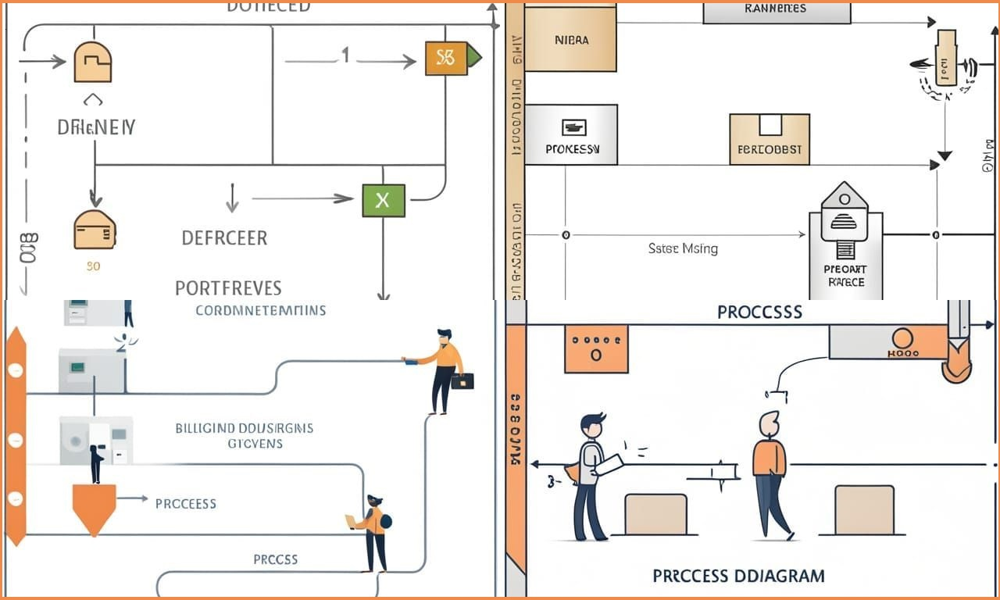
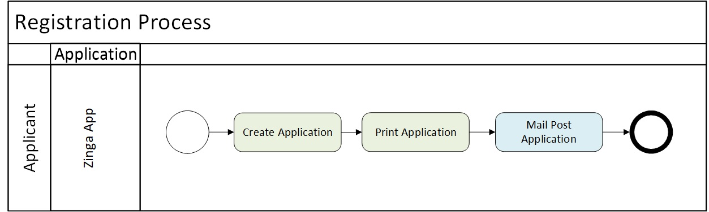
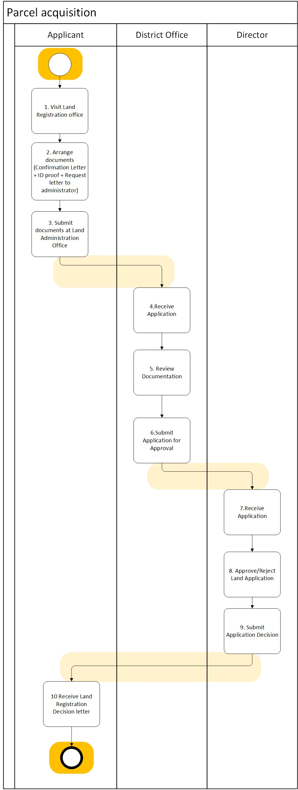
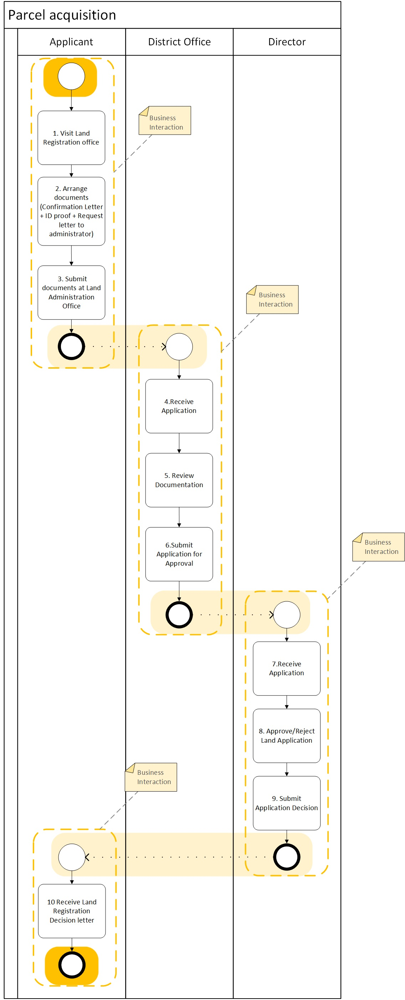
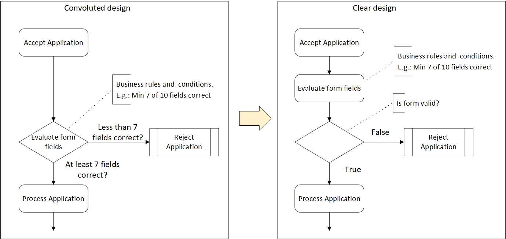
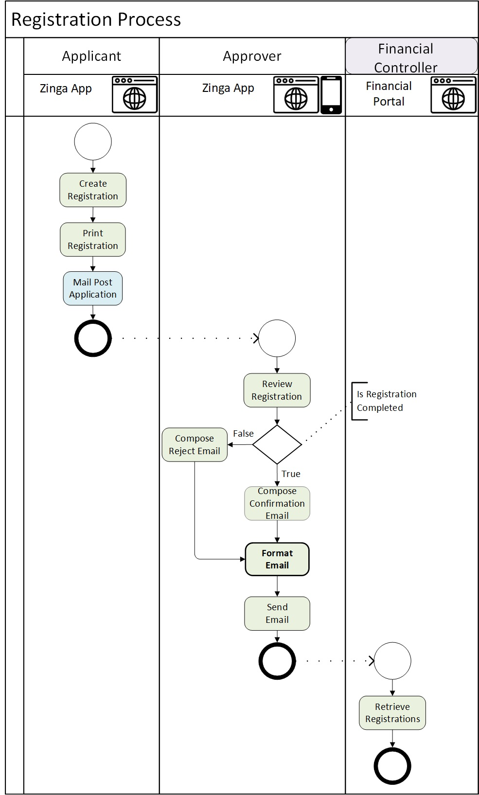

# process-diagram
 

##

 

## Intro
### Summary
In large programs, the business process is the best artefact that can be used to describe the business interactions, scope, actors, scenarios' permutations, and, to some extent, system functionality.  
If used correctly, business process diagrams can summarise many business interactions with multiple Actors, including multiple Applications online and offline activities, can indicate sequentially Activities, and can break down large processes into sub-processes.   
After the business processes documentation is completed, they are usually used as input for many other consequent works, including Architects, who receive them and consider them as input for business and system requirements.   
Sometimes, Architects need help reading these business processes because they are not detailed enough, or the notations and standards used to document them make them ambiguous. So, to streamline the work of business analysts and architects, it is better to adopt some standards and notations beforehand. This way, the documented business processes can be transformed into functional and system requirements. So, the Architects need to collaborate with the Business analysts to understand these diagrams and transform them into business and system requirements.   
If there are no standards or agreements on the use of notations, then the business processes are created with different styles, and usually, there is also a difference in the documentation if more than one business analyst works on them.  Sometimes, business analysts have different skills and opinions on how much detail these diagrams should have, and if there is no guidance, they use their criteria.  Some business analysts may use a high-level approach to describe the business flows. On other occasions, they may use detailed notations to describe business logic.   
This article proposes guidance and the adoption of specific notations; it discusses the benefits and other options for some scenarios when documenting large business processes. The guidance is based on the standards proposed by BPMN and UML, particularly the swimlane process diagrams and the activity diagrams intersection. <be>
With this guidance, business analysts can collaborate seamlessly. The architects can now use the business processes as they have been produced as input for their solutions, architecture design, and applications. <be>
Also, the product owners or scrum masters can benefit from these guidances because they can use these business processes as input for their agile process, in particular, to define epics and create user stories.    
If the process diagrams are too high level, do not show all the actors involved, or do not show enough details for architects to use as input, it could require that the process diagrams be further refined and clarified before actually being useful for architecture input.    
Discussing the purpose and the motivation of defining which standards to use when constructing these process diagrams can increase the productivity of the business analyst and the architects involved in large projects.  

#### References
Most of the notations are taken from the modern definition of OMG BPM and OMG UML Activity Diagrams.  
 
Object Management Group  (OMG®) 
https://www.bpmn.org/  
 
OMG® - Business Process Management Notation® (BPMN) - Definition  
http://www.omg.org/spec/BPMN/2.0/  
 
OMG® - BPMN Version 2.0   
https://www.omg.org/spec/BPMN/2.0/PDF  

* Section  11.7.2 Swimlanes (Page 363)  
* Section 10.2 Activities (Page 151)  
 
OMG® - Unified Modeling Language® (UML) Definition  
http://www.omg.org/spec/UML/   
 
OMG® - UML Version 2.5.1   
https://www.omg.org/spec/UML/2.5.1/PDF  

* Section 15. Activities  (Page 373)  
* Sub-section 15.5 Executable Nodes (Page 403)  
* Sub-section 15.6 Activity Groups (Page 405)  
 
 
 

## Swimlanes
Swimlines represent participants in the process. They are subdivided into Pools and Lanes.
 
### Pool
A Pool is the graphical representation of a Participant in a Collaboration. It also acts as a “swimlane” and a graphical container for partitioning a set of Activities from other Pools, usually in the context of multiple organisations. A Pool MAY have internal details in the form of the Process that will be executed. 
 

 
 
### Lane
A Lane is a sub-partition within a Process, sometimes within a Pool, and will extend the entire length of the Process, either vertically or horizontally. Lanes are used to organize and categorize Activities.   
 

 
 
 
 

## Actor - Swimlanes
The Swimlanes represent Actors.  
 
The concept of the 'Actor' does not formally exist in the BMPN.  
 
However, it is important to know that it is beneficial to adopt some convention to correlate the BPMN diagrams with the consequent flesh down of User Requirements.  
The User Requirements can be Epics, Agile User Stories, or UML Use Cases.  
Therefore, it is advised that adopting the correct naming conventions for the Swimlanes can lead to making the User Requirements much easier because they will have a matching "Actor" in the BPMN business interactions.   

 

**Correlation Table**  
 

| #	| Element  | Description | 
| --- | --- | --- |
|1|		Actor - Swimlines - Business Process|A Swimline is the graphical representation of a Participant collaborating in a process.|
|2|		Actor - Use Cases - UML Methodology| As per UML definition, the Actor is used to specify a role played by a user or any other system interacting with the subject by exchanging signals and data.   Actors are used when creating Use Cases.  The Use Cases can be inferred by identifying one or more Activities in the Actor's swimlane.  |
|3|		Persona - User Stories - Agile Methodology|As per the Agile methodology definition, a Persona represents the fictional characteristics of the people most likely to buy your product. Personas provide a detailed summary of your ideal customer, including demographic traits such as location, age, and job title and psychographic traits such as behaviours, feelings, needs, and challenges.   Personas are used when creating User Stories. The Persona definition is not directly correlated to a Role in the system. However, many times, Personas are used equivalently to User Roles.  The User Stories can be inferred by identifying one or more Activities in the Actor's swimlane.  |
|4|		User Roles - Application Role|A User Role is a predefined category that can be assigned to users based on the responsibilities they need to perform in a system.   Some User Roles surface early in the analysis and design stages. These are not definitive, and it is recommended to have a formal rationalisation process to make the Roles definitive and confirm them before the detailed design stage.  Although these early identified User Roles can change, they can be used as provisional and be part of the analysis and design process.  The User Role Responsabilities  can be inferred by identifying one or more Activities in the Actor's swimlane.  ||

 
 
 

## Activity 
Activities signify a granular task that is performed as part of the process.  

### Naming conventions
#### Offline Activities names
Off-line Activities can be named as best described, for example, by using a verb and nouns:    

* "Collect a pamphlet"
* "Ring the bell"
* "Complete paper form"
* "Post letter"
  
#### Online Activities names
On the contrary, Activities' names can be more structured since they are meant to be digitised; therefore, they should be named after the operation performed (a verb) and the entity (noun).  
The operation is a verb that, in most cases, can be one of the CRUD operations. For example:  
* "Create Invoice"
* "Read Invoice" (Search and Retrieve)
* "Update Invoice" ('Upsert' also permitted)
* "Delete Invoice"
  
### Offline and Online
Notice that there could be offline and online Activities.   
* Offline Activities    
  They are not performed in any system. They are usually paper-based activities that cannot be or do not necessarily create any evidence that can be recorded in a system. <be>
 

* Online Activities    
  These are Activities in a digital system, and they create, modify or delete business records that can be traced back to the User. 

### Example
For example, in the following diagram, there are Online and Offline Activities; they follow a specific naming convention above and have been coloured differently for quick reference.  
 

 
 
 
 

## Orientation 
 

Use **Top-to-bottom, Left-to-right**.<be>
 

Most occidental alphabets conform to the convention to be read and written from left to right and read from top to bottom.<be>
Therefore, it is advised that the processes also follow as much as possible a flow that allows readers to read the activities in sequence from top to bottom and left to write. Regardless if the process is oriented vertically or horizontally, the sequence of activities can be arranged in that conventional order. 

### Example
#### Horizontal

#### Vertical

 
 
 

## Size
Business Processes can be fitted at most in an A3 size page, but if the Activities are not readable, it is wise to break it down into separate artefacts.  
 
 
 

## Start and End
### Process Start-End
Business Processes must have at least one Start and one End. A sequential flow connects all the Activities. 

### Business Interactions Start-End
This alternative can be used for large processes where it is useful to break down a large process into several "chunks". <be>
So, the business process is connected with several business interactions, each with its own Start and End.  

### Example

**Sequential Flow**  
 

 

**Multiple Business Interactions**  
 

 
 
 

## Temporal Events
Sometimes, Business analysts need to remember that processes triggered by time events need to be analysed and documented. These events are valid business interactions; therefore, they must be captured as part of the business requirements. So, here is the correct notation for how to start a Temporal Event.  
 
Temporal Events can be, for example,  
* Every day at 1 AM, run the reconciliation process.  
* Every 10 minutes, check for new emails in the Inbox.  
 
Temporal Events have a distinct start-process notation as follows: 
 

 
 
 

## Conditions
Sometimes, documenting the Conditions in business flows can be easy, or sometimes, it can contribute to convoluted flows. So, to have a standard principle for this is recommended the following: 
 
Temporal Events can be, for example,  
* Conditions are rhombus shape and should only lead to True or False, Yes or No Answers.  
* Before the Condition, it should have an Activity that evaluates the Business Rules and the Conditions.  

### Example
For Example:  

 
 
 

## Sub-processes
Subprocesses are needed for breaking large processes into several manageable pieces. 
Each Subprocess must be detailed in a separate diagram.  
It must continue with the same flow inputs and outputs described in the higher-level flow process.  
Also, the Actors must be the same as in the higher-level flow process.  
 

 
 
 

## Systems and Applications
### Multiple Applications
The Process diagram can include more than one application. For example:  
 

* "Engineer" Actor  
  They use an application called Workforce1 to create and submit project estimations.  
 

* "Manager" Actor  
  They use the ERP system to approve or reject the estimations.   
 

* "Financial Controller" Actor  
  They use the Finance Portal dashboard to see the project estimations.   

#### Example

### One Application - multiple components
Generally, the process diagrams describe an Application as a single participant or Actor in the process diagram. However, there could be the need to detail the Application in several components and describe some of the Application taxonomy. The Application will no longer be a single swimlane but two or more with different activities each.  
 
For example, an Application called "Zinga App" will have different components:  

* "Zinga App - Mobile". (the web frontend).
* "Zinga App - Web". (the web frontend).
* "Zinga App - Backend". (and the server side).

#### Example
 

 
Breaking down the Application into multiple sub-components could add unnecessary details to business processes. Process diagrams are not a substitute for Sequence Diagrams in terms of the amount of details that can be represented for describing system components' responsibilities. 
 
In addition, business processes can be used without representing any technology used or planned to be used. There are many cases in which business analysts add extra notations to signify what type of storage or database is used, or APIs, or Gateways, etc.   
The only notation needed is the name of the operations (a verb) performed and the entity (noun). See the "Activity" section of this document. 
 
 
 

## Error Handling
### Business Processes
Generally, business processes only detail Error Handling if the error handling itself is a process that requires documentation because it consists of several steps that need to be coordinated across multiple Actors. Error Handling is usually considered a technical implementation and is not part of the high-level process design.  
Business Processes only document happy paths and the most important permutations of the mainstream process.  
### BPMN
On the contrary, BPMN and UML Activity Diagrams are considered more detailed and technical diagrams, and they need to have the full path of executions, including error handling. 
 
 
 

## User Interface Screens
In the same way that there is a correlation between Activities and Use Cases or User Stories, there is also a correlation between Activities or a group of Activities (Business Interaction) with Application screens. So, When defining the Activities for a workflow, there could be the opportunity to start correlating these with Applications' User interfaces.  
### Example

 
 
 

## Notations

### Standard Notations
Business Process, BPMN, and UML Activity Diagrams have plenty of notations to specify different types of Activities, Messages, Text Annotations, etc. 
 
**So, first and foremost, we recommend refreshing and reviewing these notations before creating a customised element that needs to be explained.**  
 
Please look at these standard definitions in the Main Reference table in this document.

### Custom Notations
If you decide to add an extra notation, even using a colour applied to elements. We strongly recommend that you document these along with the business process. They are usually described in a separate section named "Notations". 
In most cases, customisation to notations is used to create extra categorisation for the Business Process being documented. 
 
Custom Notations could include, for example:  
* Colours
* Arrow types
* Actors types
* Icons
* Font types
* etc

### Example
They can be used for categorisation of existing or new elements. The example below is just for illustration purposes: 
 

| #	| Element  | Customisation | Description |
| --- | --- | --- | --- |
|1|		Activity|Green Colour| Online Activity.  Performed in an Application|
|2|		Activity|LighBlue Colour| Offline Activity.  Not performed in an Application|
|3|		Flow Connector|Dotted line| Connecting intermediate Start and End Business Interactions|
|4|		Browser Icon|New|Indicates the Client component of an Application|
|5|		Mobile Icon|New|Indicates the Client component of an Application|
|6|		Server Icon|New|Indicates the Server component of an Application|
|7|		Activity Name|Bold Italic Front|Indicates the Activity is new.   There is a gap in the current process|
|8|		Actor (Swimline)|Light Yellow Colour|Indicates the Actor is an existing Role in the sytem|
|9|		Actor (Swimline)|Light Purple Colour|Indicates the Actor is an new Role in the sytem|

 

**Process with customised Elements**  
 

 
 
 

## Other References
Swimlane process - Wiki  
https://en.wikipedia.org/wiki/Swimlane  
 
Activity Diagram - Wiki  
https://en.wikipedia.org/wiki/Activity_diagram  
 
Swim Lane Diagram - CIO org  
https://cio-wiki.org/wiki/Swim_Lane_Diagram  
 
Flowchart - Wiki  
https://en.wikipedia.org/wiki/Flowchart  
 
ISO-5807 (1985)   
https://www.scribd.com/document/519991367/ISO-5807-1985   
https://www.iso.org/standard/11955.html
 
ISO-5807 (1985) PDF Document  
https://www.scribd.com/document/519991367/ISO-5807-1985   
 
Flowcharting With the ANSI Standard paper 1971 - Old ISO and ANSI X3.5 standard flowchart symbols  
https://dl.acm.org/doi/pdf/10.1145/356566.356570  
 
Business Process Modeling - Wiki   
https://en.wikipedia.org/wiki/Business_process_modeling   
 
Business Process Management (BPM) - Wiki  
https://en.wikipedia.org/wiki/Business_process_management  
 
Business Process - Wiki   
https://en.wikipedia.org/wiki/Business_process   
 
Process - Wiki    
https://en.wikipedia.org/wiki/Process   
 
Workflow - Wiki    
https://en.wikipedia.org/wiki/Workflow    
 
 
 
--End of the Document--
